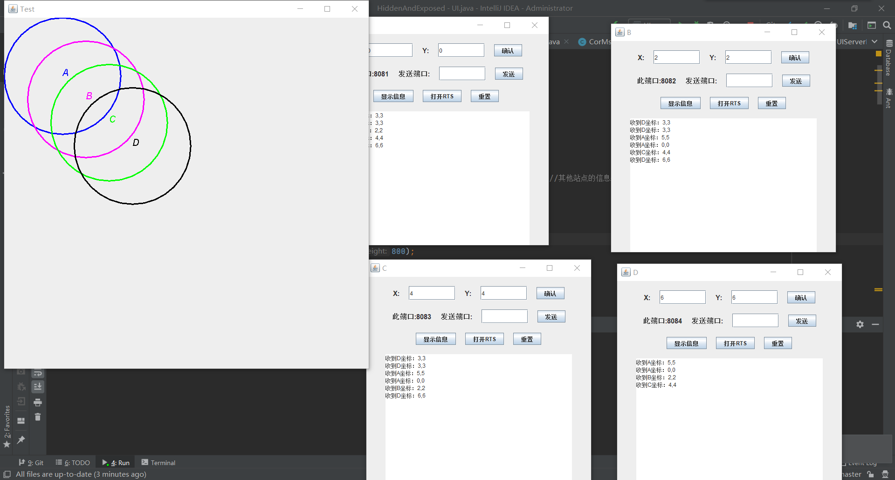

# 实验十四 模拟隐蔽站和暴露站问题
## 实验目的
要求学生掌握Socket编程技术，以及模拟隐蔽站和暴露站的过程

## 实验内容

1. 要求学生掌握利用Socket进行编程的技术
2. 初始设置4个节点（进程代替，下同），根据节点间的距离来进行判断，是否可以传递数据
3. 对于隐蔽站，双方计算随机时间发送，
4. 如何定义会产生隐蔽站和暴露站问题，可用自由发挥
5. 用图形进行显示隐蔽站和暴露站发生的过程，最少应该实现如下程度：对于隐蔽站问题，产生碰撞附近的接收节点变色，对于暴露站，可以发送但是不敢发送信息的节点变色。
6. 扩展，用rts/cts帧来减少隐蔽站和暴露站问题

# 食用方法

这个是用来模拟站点的程序，预设了 `A` `B` `C` `D` 四个站点

分别以A，B，C，D，V为参数运行main函数，然后运行UI，然后分别输入ABCD的坐标，即可显示。

